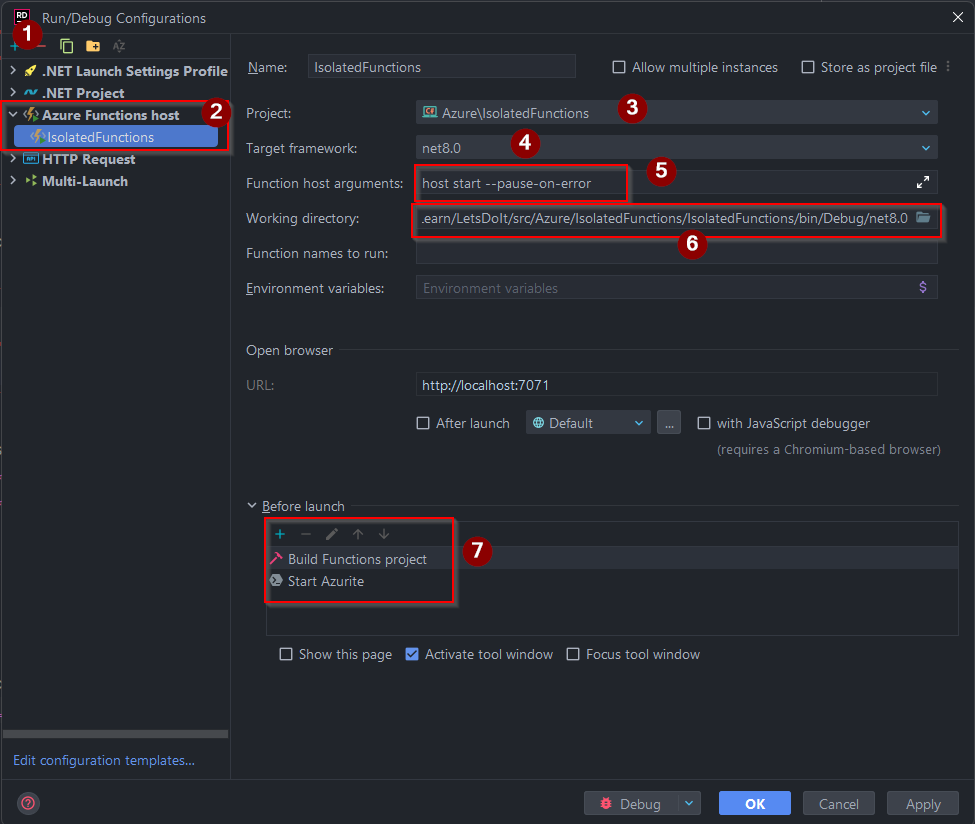

# Isolated Azure Functions

## Vanilla Project Structure

* Create a console application

* Install the below nuget packages
  * `Microsoft.Azure.Functions.Worker`
  * `Microsoft.Azure.Functions.Worker.Sdk`

* Set the `AzureFunctionsVersion` to `v4` in the `csproj` file

```xml
  <PropertyGroup>
<!--    Rest of the settings-->
    <AzureFunctionsVersion>v4</AzureFunctionsVersion>    
  </PropertyGroup>
```

* Create `local.settings.json` file with the below content

```json
{
  "IsEncrypted": false,
  "Values": {
    "AzureWebJobsStorage": "UseDevelopmentStorage=true",
    "FUNCTIONS_WORKER_RUNTIME": "dotnet-isolated",
    "FUNCTIONS_WORKER_RUNTIME_VERSION": "8.0"
  }
}
```

> Note:
> As a best practice separate sensitive data in your local development as well
> Adding a user secrets file to include sensitive configurations is a better approach

* Create `host.json` file with below content

> Note: setting the default log level to `Warning` will filter unnecessary logs.
> Set the `Function` log level to `Information` so you could actually see the logs which you want to see from functions
> If you would like to set log levels for individual functions use `Function.[FUNCTION NAME]` syntax

```json
{
  "version": "2.0",
  "logging": {
    "logLevel": {
      "default": "Warning",
      "Function": "Information"
    }
  }
}
```

* Set both `local.settings.json` and `host.json` file properties as below
  * `CopyToOutputDirectory` as `PreserveNewest`
  * `CopyToPublishDirectory` as `false`

## HTTP Trigger

* Install `Microsoft.Azure.Functions.Worker.Extensions.Http` nuget package
* Create a basic function as below

```csharp
public class CreateOrderFunction(ILogger<CreateOrderFunction> logger)
{
    [Function(nameof(CreateOrderFunction))]
    public async Task<HttpResponseData> Run([HttpTrigger(AuthorizationLevel.Anonymous, "post", Route = "orders")] HttpRequestData request)
    {
        var dtoRequest = await request.ReadFromJsonAsync<CreateOrderRequest>();
        if (dtoRequest == null)
        {
            logger.LogWarning("Create order request does not contain any data to proceed");
            return request.CreateResponse(HttpStatusCode.InternalServerError);
        }

        logger.LogInformation("{@CreateOrderRequest} request received", dtoRequest);
        var dtoResponse = new OrderAcceptedResponse(dtoRequest.OrderId,
            dtoRequest.ReferenceId, DateTimeOffset.UtcNow);
        
        
        var httpResponse = request.CreateResponse();
        await httpResponse.WriteAsJsonAsync(dtoResponse, HttpStatusCode.Accepted);
        
        return httpResponse;
    }
}
```


## Running the project locally

* Create a run configuration as shown below
 


## BLOB Trigger

> Note
> Make sure you have the latest `Azurite` running in your machine
> If you don't have the latest `Azurite` installed in your machine, you'll get an error as below at runtime


* To fix this, do the following,
  * Install latest `npm`
  * Install latest `Azurite` through `npm`

```
npm install -g npm@latest
npm install -g azurite@latest
```

* Install `Microsoft.Azure.Functions.Worker.Extensions.Storage.Blobs`

* Add a BLOB trigger function as below. It simply reads a file from a BLOB container

```csharp
public class FileCopyFunction
{
    private readonly ILogger<FileCopyFunction> _logger;

    public FileCopyFunction(ILogger<FileCopyFunction> logger)
    {
        _logger = logger;
    }

    [Function(nameof(FileCopyFunction))]
    public async Task Run([BlobTrigger("sample-work/{name}", Connection = "SourceConnection")] Stream sourceStream, string name)
    {
        using var reader = new StreamReader(sourceStream);
        var content = await reader.ReadToEndAsync();
        
        _logger.LogInformation("{FileName} was read successfully", name);
    }
}
```

* As a best practice, it's best to separate Azure function and application related storages and configurations
  * In `local.settings.json` add `AzureWebJobsSourceConnection` to point to the storage

```json
{
  "IsEncrypted": false,
  "Values": {
    "AzureWebJobsStorage": "UseDevelopmentStorage=true",
    "FUNCTIONS_WORKER_RUNTIME": "dotnet-isolated",
    "FUNCTIONS_WORKER_RUNTIME_VERSION": "8.0",
    "AzureWebJobsSourceConnection": "UseDevelopmentStorage=true"
  }
}
```

* In the Azure function we use the "SourceConnection" part only to specify the connection string

## Queue Trigger

* Install `Microsoft.Azure.Functions.Worker.Extensions.Storage.Queues` nuget package
* You can bind to [different types](https://learn.microsoft.com/en-us/azure/azure-functions/functions-bindings-storage-queue?tabs=isolated-process%2Cextensionv5%2Cextensionv3&pivots=programming-language-csharp#binding-types) when binding to the trigger, my favourite is to bind directly to the DTO type
  * `string`
  * `byte`
  * `JSON serializable type`
  * `QueueMessage`
  * `BinaryData`

* Setting storage related configuration it's similar to BLOB triggered function
* Add a queue trigger function as below

```csharp
public class ReadOrderFunction(ILogger<ReadOrderFunction> logger)
{
    [Function(nameof(ReadOrderFunction))]
    public async Task Run([QueueTrigger(queueName: "%Source:Queue%", Connection = "SourceConnection")] CreateOrderRequest message)
    {
        await Task.Delay(TimeSpan.FromSeconds(1));
        logger.LogInformation("Create order request received {@CreateOrderRequest}", message);
    }
}
```

## Multiple Responses

Sometimes we would like to do more than one thing which is related to the functionality.
An example of this would be returning a successful HTTP response, while publishing a message to the queue.

To handle such scenarios, create a specific type which contains those responses.

## Disabling a Function

* You can disable any function using configuration as below

```
"AzureWebJobs.[FUNCTION NAME].Disabled": true
```

## Adding Central Package Management

## Adding CI/CD

* Permissions Required for ServicePrincipal
* Environment Setup and Configuration
* Tagging and Releasing