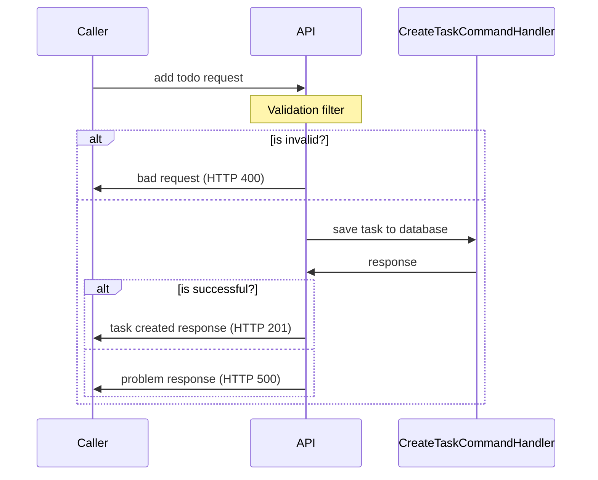
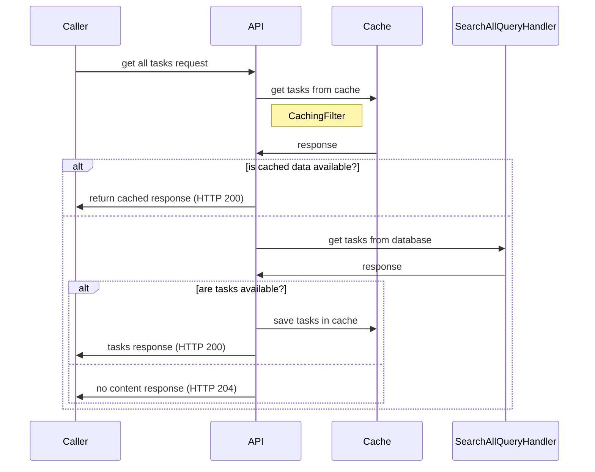
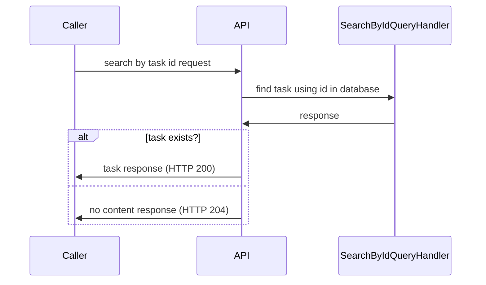

# Bunsen Burner 🔥

A testing library which helps to easily write well-structured test cases 
in both `Arrange, Act, Assert (AAA)`, and `Given, When, Then (BDD)` testing patterns.

## Context :dart:

When it comes to testing .NET applications, there are many options.

I think, as .NET developers, we are privileged to have such a plateau of options to choose.
But, this can be a problem as well, since now we have too many options to choose from 
ranging from packages, conventions, and guides.

Let me introduce you to `Bunsen Burner` where you can write tests easily in a well-structured approach 
regardless of the chosen testing patterns, naming conventions, etc...

## System Under Test :tada:

It's a simple task management API, where you can perform,
- [x] Add task
- [x] Get all tasks
- [x] Get task by id

To keep things simple enough, we are using entity framework's in-memory database for data operations.

To make things interesting `distributed caching` has been introduced when getting all tasks, 
and an `endpoint filter` has been included for validation when adding a task.

We will be using the same `ToDo API` from Microsoft's documentation, with some added extra features.
We have introduced `distributed caching`, and `endpoint filters` for the creation, and getting all task 
endpoints.

### Add Task

We will include an `endpoint filter` to perform validation on the input request.

If the request is invalid, it will be short-circuit and will return a bad request (HTTP 400) 
response back to the caller.

### Get All Tasks

We have another `endpoint filter` which will use a distributed cache to cache the response.
To keep things simple enough, for the distributed cache, we are using `Microsoft.Extensions.Caching.Memory` 
which is an in-memory implementation of `IDistributedCache`.

### Search Task by Id

## Testing `Get All Tasks` feature

We'll use unit tests to test the internal operations, and an integration test approach
to test the behaviour of this feature.

For unit tests, let's use the `AAA` pattern, and for integration tests the `behavioural` pattern. 

### Unit tests of the `GetAll.Operations` class

> Cache only if tasks are available in database

Without using `Bunsen Burner`

For unit tests I have followed the `AAA` pattern, and for integration tests
I have used the `BDD` approach as they seem to fit with 

To understand the differences, let's focus on how to test the endpoint filter
`GetAllTasksFilter`.

without using Bunsen Burner :frowning:

Let's consider testing the endpoint filter `GetAllTasksFilter`.

### Unit Tests

Let's use the `Arrange, Act, Assert` pattern for unit tests.

### Integration Tests

Let's use the `Given, When, Then` pattern (behavioural driven) for integration tests.

### Kudos :clap:

* [Bunsen Burner in GitHub](https://github.com/bmazzarol/Bunsen-Burner)