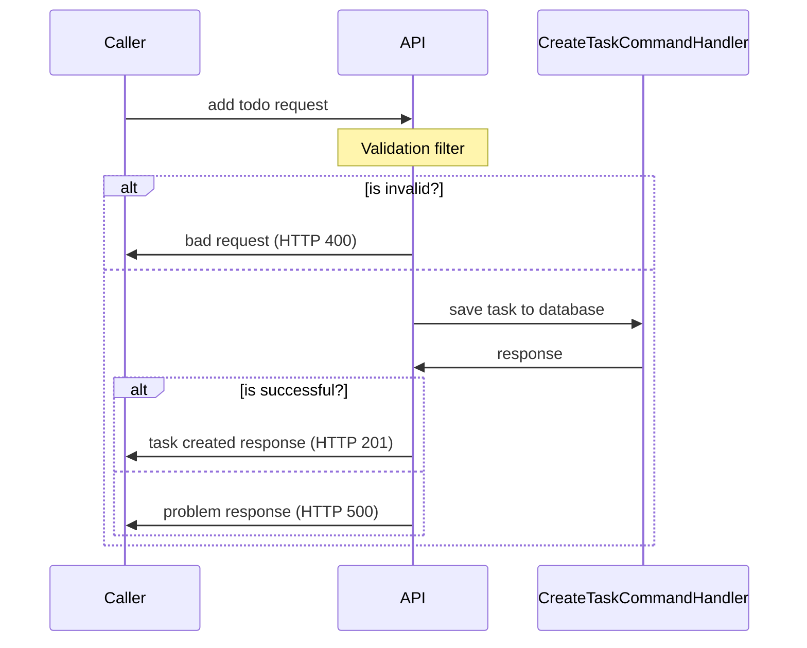
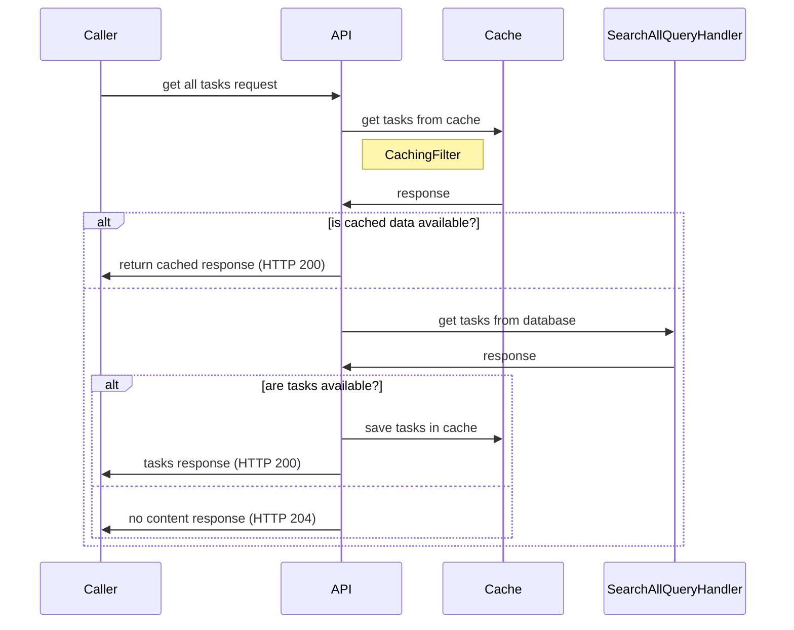
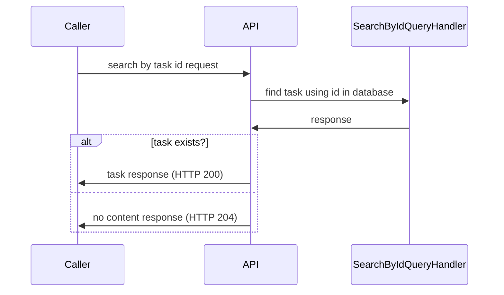

# Bunsen Burner 🔥

A [testing library](https://github.com/bmazzarol/Bunsen-Burner) which helps to easily write 
well-structured test cases in both `Arrange, Act, Assert (AAA)`, and `Given, When, Then (BDD)`
testing patterns.

## Context :dart:

When it comes to testing .NET applications, there are many options.

I think, as .NET developers, we are privileged to have such a plateau of options to choose.
But, this can be a problem as well, since now we have too many options to choose, ranging 
from packages, conventions, and guides.

Let me introduce you to `Bunsen Burner` where you can write tests easily in a well-structured approach 
regardless of the chosen testing patterns, naming conventions, etc...

## Why Bunsen Burner?

- [x] Can easily write tests in a more structured, and in an organized manner
- [x] If you can write basic C#, that's it! Nothing new to learn
- [x] Both `AAA`, and `BDD` style patterns are supported through a fluent API syntax
- [x] Easily extendable using extension methods
  - [x] This will make it easier for your setups, and assertions
- [x] All tests must return a `Task` (this is as per design in `Bunsen Burner`)
  - [x] This is better as now you don't want to worry about whether the SUTs are synchronous or asynchronous

## Let's write some fun math tests

You can find these tests in the `ExampleTests.cs` file in the `LetsDoIt.ToDoApi.BunsenBurner.Tests` project.

### Adding numbers

Using `Bunsen Burner`

```csharp
[Theory(DisplayName = "Adding numbers")]
[InlineData(1, 1, 2)]
[InlineData(1, -1, 0)]
public static async Task TestAddWithBunsen(int a, int b, int expected) =>
    await Arrange(() => (a,b))
        .Act(input => input.a + input.b)
        .Assert(result => result == expected);
```

Without using `Bunsen Burner`

```csharp
[Theory(DisplayName = "Adding numbers")]
[InlineData(1, 1, 2)]
[InlineData(1, -1, 0)]
public static void TestAdd(int a, int b, int expected)
{
    // Arrange (the input data is provided)

    // Act
    var result = a + b;

    // Assert
    Assert.Equal(expected, result);
}
```

- [x] When using `Bunsen Burner`, the `Arrange`, `Act`, and the `Assert` sections are separated
- [x] No need to add comments to separate the sections
- [x] You can have predicates in the `Assert` section. This is not possible without using `Bunsen Burner`
- [x] The function chaining pattern, makes it easier to read, and understand the test
- [x] By using function chaining pattern, the data flow is flown from the `Arrange` to the `Act`, and then to the `Assert` sections


### Division by zero

Using `Bunsen Burner`

```csharp
[Fact(DisplayName = "Division by zero")]
public static async Task DivisionByZeroBunsen() =>
    // ReSharper disable once IntDivisionByZero
    await 1
        .ArrangeData()
        .Act(x => x / 0)
        .AssertFailsWith(exception =>
        {
            Assert.IsType<DivideByZeroException>(exception);
        })
        .And(exception => exception.Message == "Attempted to divide by zero.");
```

Without using `Bunsen Burner`

```csharp
[Fact(DisplayName = "Division by zero")]
public static void DivisionByZero()
{
    // Arrange
    var denominator = 0;

    // Act and Assert
    var exception = Assert.Throws<DivideByZeroException>(() => 1 / denominator);
    Assert.Equal("Attempted to divide by zero.", exception.Message);
}
```
- [x] Regardless of exception being thrown the `Arrange`, `Act`, and the `Assert` sections are separated and remains the same like before
- [x] Extension methods such as `ArrangeData` has been provided, so an object can be readily available as an `Arrange` section
- [x] By using the function chaining pattern, can easily add more assertions to the test (this can be done for `Arrange` sections as well)


Well enough with the math tests, let's move on to something more interesting! :tada: :heart:

## System Under Test :tada:

It's a simple task management API, where you can perform,
- [x] Add task
- [x] Get all tasks
- [x] Get task by id

To keep things simple enough, we are using entity framework's in-memory database for data operations.

To make things interesting `distributed caching` has been introduced when getting all tasks, 
and an `endpoint filter` has been included for validation when adding a task.

### Add Task

We will include an `endpoint filter` to perform validation on the input request.



### Get All Tasks

In here we'll use an `endpoint filter` to cache the tasks retrieved from database.
To implement distributed cache, we are using `Microsoft.Extensions.Caching.Memory` 
which is an in-memory implementation of `IDistributedCache`.



### Search Task by Id



## Testing `Get All Tasks`

We'll use unit tests to test the internal operations, and an integration test approach
to test the behaviour of this feature from an endpoint perspective.

For unit tests, let's use the `AAA` pattern, and for integration tests the `behavioural` pattern. 

### Unit tests of the `GetAll.Operations` class

> Cache only if tasks are available in database

Without using `Bunsen Burner`

```csharp
[Fact(DisplayName = "Cache only if tasks are available in database")]
public static async Task CacheOnlyIfTasksAreAvailable()
{
    // Arrange
    var mockedCache = new Mock<IDistributedCache>();

    var mockedQueryHandler = new Mock<IQueryHandler<SearchAllQuery,
        List<TodoDataModel>>>();
    mockedQueryHandler
        .Setup(x => x.QueryAsync(It.IsAny<SearchAllQuery>(), It.IsAny<CancellationToken>())).ReturnsAsync([]);

    // Act
    var response = await Operations.ExecuteAsync(mockedCache.Object, mockedQueryHandler.Object, Mock.Of<ILogger<Program>>());

    // Assert
    mockedCache.Verify(
        x =>
            x.SetAsync(
                Constants.CacheKey,
                It.IsAny<byte[]>(),
                It.IsAny<DistributedCacheEntryOptions>(),
                It.IsAny<CancellationToken>()
            ),
        Times.Never()
    );

    response.Result.Should().BeOfType<NoContent>();
}
```

As you can see above, we usually use "comments" to segregate the arranges, act, and the respective asserts.
This test could be a simple one to contrast, but think we can all agree that, if there were lot to set up in 
the "arrange" section or in the assertions this could, will definitely look messy.

Using `Bunsen Burner` for the same test,

```csharp
[Fact(DisplayName = "Cache only if tasks are available in database")]
public static async Task CacheOnlyIfTasksAreAvailable() =>
    await Arrange(() =>
        {
            var mockedCache = new Mock<IDistributedCache>();

            var mockedQueryHandler = new Mock<IQueryHandler<SearchAllQuery, List<TodoDataModel>>>();
            mockedQueryHandler
                .Setup(x => x.QueryAsync(It.IsAny<SearchAllQuery>(), It.IsAny<CancellationToken>()))
                .ReturnsAsync([]);

            return (mockedCache, mockedQueryHandler);
        })
        .Act(async data =>
            await Operations.ExecuteAsync(
                data.mockedCache.Object,
                data.mockedQueryHandler.Object,
                Mock.Of<ILogger<Program>>()
            )
        )
        .Assert(
            (data, _) =>
            {
                data.mockedCache.Verify(
                    x =>
                        x.SetAsync(
                            Constants.CacheKey,
                            It.IsAny<byte[]>(),
                            It.IsAny<DistributedCacheEntryOptions>(),
                            It.IsAny<CancellationToken>()
                        ),
                    Times.Never
                );
            }
        )
        .And(response => { response.Result.Should().BeOfType<NoContent>(); });
```

There are some striking differences with this approach. 
* The `Arrange`, `Act`, and the `Assertions` have been separated
* Multiple "arrange" sections, and "assert" sections can be written using the fluent API syntax
* Arranged data, are passed to the `Act` section as function parameter
* All the "arranged" data, and the "act response/s" are passed to the "Assert" section for assertions

> **Note:**
> 
> Please refer the other tests for the `Operations` class with and without using `Bunsen Burner`.
>

### Integration tests of the `GetAll` endpoint

In here we are using `Microsoft.AspNetCore.Mvc.Testing` to set up integration tests.

We'll be using the `behavioural` pattern in here.

When testing this,
* We'll need to inject an in-memory database implementation
* We'll need to call the endpoint twice, to check whether it uses the distributed cache

Without using `Bunsen Burner`

```csharp
[Fact(DisplayName = "Given tasks are cached, when get all endpoint is called, then must return tasks from the cache")]
public async Task GetAllTasksWhenCached()
{
    // Given
    var httpClient = factory
        .WithWebHostBuilder(builder =>
        {
            builder.ConfigureTestServices(services =>
            {
                var dbContextDescriptor = services.SingleOrDefault(d =>
                    d.ServiceType == typeof(DbContextOptions<TodoDbContext>)
                );
                if (dbContextDescriptor != null)
                    services.Remove(dbContextDescriptor);

                services.AddDbContext<TodoDbContext>(optionsBuilder => { optionsBuilder.UseInMemoryDatabase(Guid.NewGuid().ToString("N")); });

                var tasks = new Fixture().CreateMany<TodoDataModel>().ToList();
                var mockedCache = new Mock<IDistributedCache>();
                mockedCache
                    .SetupSequence(x => x.GetAsync(It.IsAny<string>(), It.IsAny<CancellationToken>()))
                    .ReturnsAsync([])
                    .ReturnsAsync(JsonSerializer.SerializeToUtf8Bytes(tasks, Constants.SerializerOptions));

                services.AddSingleton(mockedCache.Object);
            });
        })
        .CreateClient();

    // When
    var httpResponse1 = await httpClient.GetAsync("/todos");
    var httpResponse2 = await httpClient.GetAsync("/todos");

    // Then
    httpResponse1.StatusCode.Should().Be(HttpStatusCode.NoContent);
    httpResponse2.StatusCode.Should().Be(HttpStatusCode.OK);

    var responseContent2 = await httpResponse2.Content.ReadAsStringAsync();
    var todoListResponse = JsonSerializer.Deserialize<TodoListResponse>(responseContent2, Constants.SerializerOptions);
    todoListResponse.Should().NotBeNull();
    todoListResponse!.Tasks.Should().NotBeNull().And.HaveCount(3);
}
```
As you could see, there's lot going on in the setup and in the assertions, and this could easily become messy
on what you are testing of course.

Using `Bunsen Burner`
```csharp
[Fact(DisplayName = "Given tasks are cached, when get all endpoint is called, then must return tasks from the cache")]
public async Task GetAllTasksWhenCached() =>
    await Given(() =>
        {
            return factory.WithWebHostBuilder(builder =>
            {
                builder.ConfigureTestServices(services =>
                {
                    var dbContextDescriptor = services.SingleOrDefault(d =>
                        d.ServiceType == typeof(DbContextOptions<TodoDbContext>)
                    );
                    if (dbContextDescriptor != null)
                        services.Remove(dbContextDescripto
                    services.AddDbContext<TodoDbContext>(optionsBuilder => { optionsBuilder.UseInMemoryDatabase(Guid.NewGuid().ToString("N")); });
                });
            });
        })
        .And(f =>
        {
            return f.WithWebHostBuilder(builder =>
                {
                    builder.ConfigureTestServices(services =>
                    {
                        var tasks = new Fixture().CreateMany<TodoDataModel>().ToList();
                        var mockedCache = new Mock<IDistributedCache>();
                        mockedCache
                            .SetupSequence(x => x.GetAsync(It.IsAny<string>(), It.IsAny<CancellationToken>()))
                            .ReturnsAsync([])
                            .ReturnsAsync(JsonSerializer.SerializeToUtf8Bytes(tasks, Constants.SerializerOptions
                        services.AddSingleton(mockedCache.Object);
                    });
                })
                .CreateClient();
        })
        .When(async client =>
        {
            var httpResponse1 = await client.GetAsync("/todos");
            var httpResponse2 = await client.GetAsync("/todos");
            return (httpResponse1, httpResponse2);
        })
        .Then(responses =>
        {
            responses.httpResponse1.StatusCode.Should().Be(HttpStatusCode.NoContent);
            responses.httpResponse2.StatusCode.Should().Be(HttpStatusCode.OK);
        })
        .And(async responses =>
        {
            var responseContent2 = await responses.httpResponse2.Content.ReadAsStringAsync();
            var todoListResponse = JsonSerializer.Deserialize<TodoListResponse>(
                responseContent2,
                Constants.SerializerOptions
            );
            todoListResponse.Should().NotBeNull();
            todoListResponse!.Tasks.Should().NotBeNull().And.HaveCount(3);
        });
```

That's right! `Bunsen Burner` supports both `AAA`, and `BDD` patterns of testing.

The setting up, and the assertions are the same, and the test is more structured.

If you want to perform, another setup, or an assertion, the best approach, is to simply 
use the `And` method using fluent API syntax and perform the operation. 
Further, if you want to extend the functionality you can merely create your own extension method
and extend it.

> **NOTE:**
> 
> [Tests using BunsenBurner](../../tests/LetsDoIt.ToDoApi.BunsenBurner.Tests) can be found here.
> 
> [Tests without using BunsenBurner](../../tests/LetsDoIt.ToDoApi.Tests) can be found here, for you to compare and reference.


### References :clap:

* [Bunsen Burner on GitHub](https://github.com/bmazzarol/Bunsen-Burner)