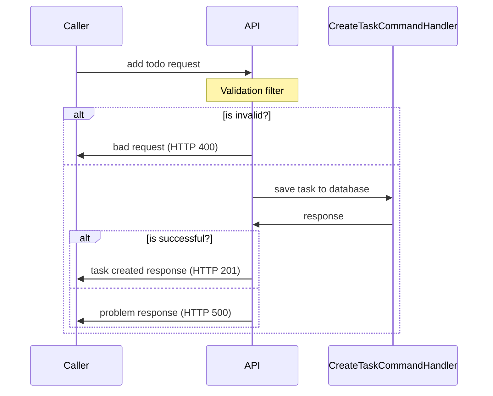
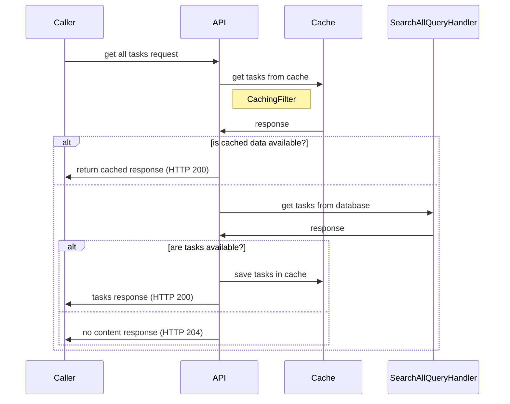
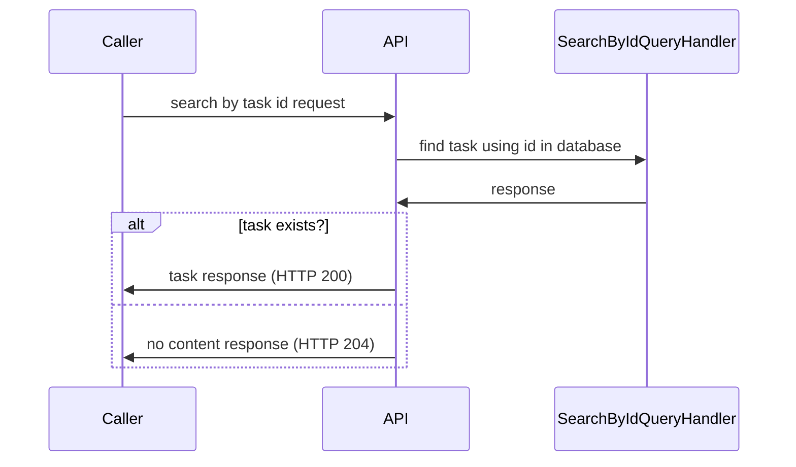

# Bunsen Burner 🔥

A [testing library](https://github.com/bmazzarol/Bunsen-Burner) which makes it easier to write
well-structured test cases in both `Arrange, Act, Assert (AAA)`, and `Given, When, Then (BDD)`
testing patterns.

## Context :dart:

When it comes to testing .NET applications, there are many options, and opinions.

It's always better to have a variety of options to choose from, and it really comes down to the team
and the practices followed by that team.

But regardless of the chosen practice; writing better tests with structure and organization has
always been important, and this is where `Bunsen Burner` comes in.

`Bunsen Burner` makes writing well-structured tests easier.

## Why Bunsen Burner?

- [x] Can easily write tests in a more structured and organized manner
- [x] If you can write basic C#, that's it! Nothing new to learn
- [x] Both `AAA`, and `BDD` styles are supported through in a fluent way
- [x] Easily extendable using simple methods
    - [x] Having methods makes it DRY
    - [x] You could even pull these methods into a separate class, or library to reuse across projects
- [x] `Async` first design so that you can write synchronous or asynchronous tests with ease (this is as per design
  in `Bunsen Burner`)

## Let's write some fun math tests

You can find these tests in the [`ExampleTests.cs`](../../tests/LetsDoIt.ToDoApi.BunsenBurner.Tests/ExampleTests.cs)
file in the `LetsDoIt.ToDoApi.BunsenBurner.Tests` project.

### Adding numbers

Using `Bunsen Burner`

```csharp
[Theory(DisplayName = "Adding numbers")]
[InlineData(1, 1, 2)]
[InlineData(1, -1, 0)]
public static async Task TestAddWithBunsen(int a, int b, int expected) =>
    await Arrange(() => (a,b))
        .Act(input => input.a + input.b)
        .Assert(result => result == expected);
```

Without using `Bunsen Burner`

```csharp
[Theory(DisplayName = "Adding numbers")]
[InlineData(1, 1, 2)]
[InlineData(1, -1, 0)]
public static void TestAdd(int a, int b, int expected)
{
    // Arrange (the input data is provided)

    // Act
    var result = a + b;

    // Assert
    Assert.Equal(expected, result);
}
```

- [x] When using `Bunsen Burner`, the `Arrange`, `Act`, and the `Assert` sections are separated
- [x] No need to add comments to separate the sections
- [x] You can have predicate expressions in the `Assert` section. This is not possible without using `Bunsen Burner`
- [x] The function chaining pattern, makes it easier to read, and understand the "flow" of the test

### Division by zero

Using `Bunsen Burner`

```csharp
[Fact(DisplayName = "Division by zero")]
public static async Task DivisionByZeroBunsen() =>
    // ReSharper disable once IntDivisionByZero
    await 1
        .ArrangeData()
        .Act(x => x / 0)
        .AssertFailsWith(exception =>
        {
            Assert.IsType<DivideByZeroException>(exception);
        })
        .And(exception => exception.Message == "Attempted to divide by zero.");
```

Without using `Bunsen Burner`

```csharp
[Fact(DisplayName = "Division by zero")]
public static void DivisionByZero()
{
    // Arrange
    var denominator = 0;

    // Act and Assert
    var exception = Assert.Throws<DivideByZeroException>(() => 1 / denominator);
    Assert.Equal("Attempted to divide by zero.", exception.Message);
}
```

- [x] Regardless of the exception being thrown the `Arrange`, `Act`, and the `Assert` sections are separated and remain
  the same
- [x] Extension methods such as `ArrangeData` are been provided, so an object can be lifted into an `Arrange` section
- [x] By using the function chaining pattern, you can easily add more assertions to the test (this can be done
  for `Arrange`, and `Act` sections as well)

Well enough with the math tests, let's move on to something more interesting! :tada: :heart:

## System Under Test :tada:

It's a simple task management API, where you can perform,

- [x] Adding a task
- [x] Getting all tasks
- [x] Getting a task by id

To keep things simple, we are using entity framework's in-memory database for the data operations.

And to make things interesting we are adding `distributed caching` when getting all tasks,
and an `endpoint filter` for validation when adding a task.

### Adding a Task

We will include an `endpoint filter` to perform validation on the input request.



### Geting All Tasks

In here we'll use an `endpoint filter` to cache the tasks retrieved from the database.
To implement distributed caching, we are using `Microsoft.Extensions.Caching.Memory`
which is an in-memory implementation of `IDistributedCache`.



### Searching Tasks by Id



## Testing `Getting All Tasks`

We'll use unit tests to test the internal operations, and an integration test approach
to test the behaviour of this feature from an endpoint perspective.

For unit tests, let's use the `AAA` pattern, and for integration tests the `behavioural` pattern.

### Unit tests for the `GetAll.Operations` class

> Cache only if tasks are in the database

Without using `Bunsen Burner`

```csharp
[Fact(DisplayName = "Cache only if tasks are available in database")]
public static async Task CacheOnlyIfTasksAreAvailable()
{
    // Arrange
    var mockedCache = new Mock<IDistributedCache>();

    var mockedQueryHandler = new Mock<IQueryHandler<SearchAllQuery,
        List<TodoDataModel>>>();
    mockedQueryHandler
        .Setup(x => x.QueryAsync(It.IsAny<SearchAllQuery>(), It.IsAny<CancellationToken>())).ReturnsAsync([]);

    // Act
    var response = await Operations.ExecuteAsync(mockedCache.Object, mockedQueryHandler.Object, Mock.Of<ILogger<Program>>());

    // Assert
    mockedCache.Verify(
        x =>
            x.SetAsync(
                Constants.CacheKey,
                It.IsAny<byte[]>(),
                It.IsAny<DistributedCacheEntryOptions>(),
                It.IsAny<CancellationToken>()
            ),
        Times.Never()
    );

    response.Result.Should().BeOfType<NoContent>();
}
```

As you can see above, we usually use "comments" to segregate the arranges, act, and the respective asserts.
This test could be a simple one to contrast against as this test does not contain complicated arrange sections or
assertions.

But if you imagine a test case where you had to setup a few more things, and there were many assertions then using this
approach could become messy.

Using `Bunsen Burner` for the same test,

```csharp
[Fact(DisplayName = "Cache only if tasks are available in database")]
public static async Task CacheOnlyIfTasksAreAvailable() =>
    await Arrange(() =>
        {
            var mockedCache = new Mock<IDistributedCache>();

            var mockedQueryHandler = new Mock<IQueryHandler<SearchAllQuery, List<TodoDataModel>>>();
            mockedQueryHandler
                .Setup(x => x.QueryAsync(It.IsAny<SearchAllQuery>(), It.IsAny<CancellationToken>()))
                .ReturnsAsync([]);

            return (mockedCache, mockedQueryHandler);
        })
        .Act(async data =>
            await Operations.ExecuteAsync(
                data.mockedCache.Object,
                data.mockedQueryHandler.Object,
                Mock.Of<ILogger<Program>>()
            )
        )
        .Assert(
            (data, _) =>
            {
                data.mockedCache.Verify(
                    x =>
                        x.SetAsync(
                            Constants.CacheKey,
                            It.IsAny<byte[]>(),
                            It.IsAny<DistributedCacheEntryOptions>(),
                            It.IsAny<CancellationToken>()
                        ),
                    Times.Never
                );
            }
        )
        .And(response => { response.Result.Should().BeOfType<NoContent>(); });
```

There are some striking differences with this approach.

* The `Arrange`, `Act`, and the `Assertions` have been separated
* Multiple "arrange" sections, and "assert" sections can be written using a fluent approach
* Arranged data is passed to the `Act` section as a function parameter
* All the "Arranged" data, and the "Act/s" are passed to the "Assert" section for assertions

> **Note:**
>
> Please refer to the other tests for the `Operations` class with and without using `Bunsen Burner`.
>

### Integration tests of the `GetAll` endpoint

Here we are using `Microsoft.AspNetCore.Mvc.Testing` to set up integration tests using Test server, and we'll be using
the `behavioural` pattern.

When testing this,

* We'll need to inject an in-memory database implementation
* We'll need to call the endpoint twice, to check whether it uses the distributed cache

Without using `Bunsen Burner`

```csharp
[Fact(DisplayName = "Given tasks are cached, when get all endpoint is called, then must return tasks from the cache")]
public async Task GetAllTasksWhenCached()
{
    // Given
    var fixture = new Fixture();
    var mockedQueryHandler = GetMockedQueryHandler(
        [],
        fixture.CreateMany<TodoDataModel>(5).ToList(),
        fixture.CreateMany<TodoDataModel>(10).ToList()
    );
    var httpClient = factory
        .WithWebHostBuilder(builder =>
        {
            builder.ConfigureTestServices(services =>
            {
                services.AddSingleton(mockedQueryHandler.Object);
            });
        })
        .CreateClient();

    // When
    // Call the endpoint three times
    var httpResponse1 = await httpClient.GetAsync("/todos");
    var httpResponse2 = await httpClient.GetAsync("/todos");
    var httpResponse3 = await httpClient.GetAsync("/todos");

    // Then
    // The query handler must be called only two times, as the third response must be taken from the cache
    mockedQueryHandler.Verify(x => x.QueryAsync(It.IsAny<SearchAllQuery>(), It.IsAny<CancellationToken>()), Times.Exactly(2));
    // The first response must be 204 No Content
    // The second and third responses must be 200 OK
    httpResponse1.StatusCode.Should().Be(HttpStatusCode.NoContent);
    httpResponse2.StatusCode.Should().Be(HttpStatusCode.OK);
    httpResponse3.StatusCode.Should().Be(HttpStatusCode.OK);

    var todoListResponse = await GetToDoListResponse(httpResponse2);
    todoListResponse.Should().NotBeNull();
    todoListResponse!.Tasks.Should().NotBeNull().And.HaveCount(5);

    todoListResponse = await GetToDoListResponse(httpResponse3);
    todoListResponse.Should().NotBeNull();
    todoListResponse!.Tasks.Should().NotBeNull().And.HaveCount(5);
}
```

As you could see, there's lot going on in the setup and in the assertions, and this could easily detract from what we
are trying to test.

Using `Bunsen Burner`

```csharp
[Fact(DisplayName = "Given tasks are cached, when get all endpoint is called, then must return tasks from the cache")]
public async Task GetAllTasksWhenCached() =>
    await Given(() =>
        {
            var fixture = new Fixture();
            return GetMockedQueryHandler(
                [],
                fixture.CreateMany<TodoDataModel>(5).ToList(),
                fixture.CreateMany<TodoDataModel>(10).ToList()
            );
        })
        .And(qh =>
        {
            var client = factory
                .WithWebHostBuilder(builder =>
                {
                    builder.ConfigureTestServices(services =>
                    {
                        services.AddSingleton(qh.Object);
                    });
                })
                .CreateClient();

            return (queryHandler: qh, client);
        })
        .When(async data =>
        {
            var httpResponse1 = await GetAllTasks(data.client);
            return httpResponse1;
        })
        .And(
            async (data, httpResponse1) =>
            {
                var httpResponse2 = await GetAllTasks(data.client);
                return (httpResponse1, httpResponse2);
            }
        )
        .And(
            async (data, responses) =>
            {
                var httpResponse3 = await GetAllTasks(data.client);
                return (responses.httpResponse1, responses.httpResponse2, httpResponse3);
            }
        )
        .Then(responses =>
        {
            responses.httpResponse1.StatusCode.Should().Be(HttpStatusCode.NoContent);
            responses.httpResponse2.StatusCode.Should().Be(HttpStatusCode.OK);
            responses.httpResponse3.StatusCode.Should().Be(HttpStatusCode.OK);
        })
        .And(
            (data, _) =>
            {
                data.queryHandler.Verify(
                    x => x.QueryAsync(It.IsAny<SearchAllQuery>(), It.IsAny<CancellationToken>()),
                    Times.Exactly(2)
                );
            }
        )
        .And(async responses =>
        {
            var todoListResponse = await GetToDoListFromResponse(responses.httpResponse2);
            todoListResponse.Should().NotBeNull();
            todoListResponse!.Tasks.Should().NotBeNull().And.HaveCount(5);
        })
        .And(async responses =>
        {
            var todoListResponse = await GetToDoListFromResponse(responses.httpResponse3);
            todoListResponse.Should().NotBeNull();
            todoListResponse!.Tasks.Should().NotBeNull().And.HaveCount(5);
        });
```

The setup and the assertions are the same, and the test is more structured.

If you want to perform another setup or an assertion, the best approach is to simply
use the `And` method.

If you want to extend the functionality simply create your own methods.

> **NOTE:**
>
> [Tests using BunsenBurner](../../tests/LetsDoIt.ToDoApi.BunsenBurner.Tests) can be found here.
>
> [Tests without using BunsenBurner](../../tests/LetsDoIt.ToDoApi.Tests) can be found here, for you to compare and
> reference.

### References :clap:

* [Bunsen Burner on GitHub](https://github.com/bmazzarol/Bunsen-Burner)

### Feedback :heart:

If you have any feedbacks, or suggestions, please feel free to open an issue on the GitHub repository.

If you want to create a PR, please feel free to do so.
When you create the PR, please make sure to follow the guidelines provided in the repository.

Please run the below commands at the root level before creating a PR, as it will format the code, according to
`CSharpier` rules.

```bash
dotnet tool restore
dotnet husky install
dotnet husky run
```